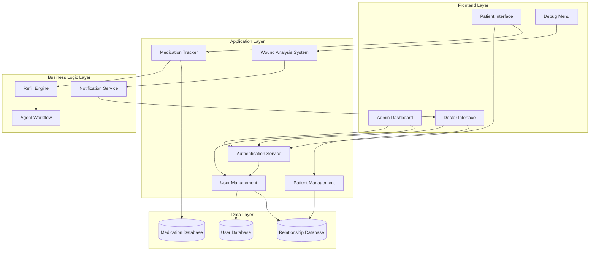

# Design Document: RecoveryPilot Enhancements

## Overview

This design extends the RecoveryPilot application with five major enhancements:

1. **Admin Dashboard**: A new administrative interface for user management and patient-doctor assignments
2. **Doctor Patient Management**: Enhanced doctor interface for managing patient care lists
3. **Testing Scenarios**: Debug menu controls for simulating different wound analysis outcomes
4. **Medication Tracking**: Real-time inventory tracking of patient medication supplies
5. **Auto-Refill Ordering**: Automated medication refill requests triggered by low inventory

The design maintains separation between roles (Admin, Doctor, Patient) and ensures data privacy through role-based access control. The medication tracking system integrates with the existing agent workflow for seamless refill processing.

## Architecture

### System Components



### Architectural Principles

1. **Role-Based Access Control (RBAC)**: All features are gated by user role authentication
2. **Separation of Concerns**: UI, business logic, and data layers are clearly separated
3. **Event-Driven Refills**: Medication tracking triggers refill events automatically
4. **Existing Integration**: New features integrate with existing agent workflow and notification systems
5. **Testability**: Debug menu provides controlled testing scenarios without affecting production data

## Components and Interfaces

### 1. Authentication Service

**Responsibility**: Verify user identity and role, enforce access control

**Interface**:
```typescript
interface AuthService {
  // Authenticate user credentials
  authenticate(username: string, password: string): Promise<AuthToken>
  
  // Verify token and return user role
  verifyToken(token: AuthToken): Promise<UserRole>
  
  // Check if user has permission for action
  hasPermission(token: AuthToken, action: string): Promise<boolean>
}

enum UserRole {
  ADMIN = "admin",
  DOCTOR = "doctor",
  PATIENT = "patient"
}

interface AuthToken {
  userId: string
  role: UserRole
  expiresAt: Date
}
```

### 2. User Management Service

**Responsibility**: Create and manage user accounts, handle user-doctor relationships

**Interface**:
```typescript
interface UserManagementService {
  // Create new user account
  createUser(userData: UserCreationData): Promise<User>
  
  // Get all users (admin only)
  getAllUsers(): Promise<User[]>
  
  // Assign patient to doctor
  assignPatientToDoctor(patientId: string, doctorId: string): Promise<void>
  
  // Get patients assigned to doctor
  getPatientsForDoctor(doctorId: string): Promise<Patient[]>
  
  // Remove patient from doctor's care list
  removePatientFromDoctor(patientId: string, doctorId: string): Promise<void>
}

interface UserCreationData {
  username: string
  password: string
  role: UserRole
  email: string
  fullName: string
  // Role-specific fields
  specialization?: string  // For doctors
  dateOfBirth?: Date       // For patients
}

interface User {
  id: string
  username: string
  role: UserRole
  email: string
  fullName: string
  createdAt: Date
}
```

### 3. Medication Tracker

**Responsibility**: Track medication inventory, trigger refill requests

**Interface**:
```typescript
interface MedicationTracker {
  // Record medication taken
  recordMedicationTaken(patientId: string, medicationId: string): Promise<void>
  
  // Get current tablet count
  getTabletCount(patientId: string, medicationId: string): Promise<number>
  
  // Check if refill needed
  checkRefillNeeded(patientId: string, medicationId: string): Promise<boolean>
  
  // Get medication details for display
  getMedicationDetails(patientId: string, medicationId: string): Promise<MedicationDetails>
}

interface MedicationDetails {
  medicationId: string
  name: string
  dosage: string
  tabletsRemaining: number
  refillThreshold: number
  lastTaken?: Date
  refillInProgress: boolean
}
```

### 4. Refill Engine

**Responsibility**: Manage automatic refill requests, prevent duplicates, invoke agent workflow

**Interface**:
```typescript
interface RefillEngine {
  // Trigger refill request
  requestRefill(patientId: string, medicationId: string): Promise<RefillRequest>
  
  // Check if refill already in progress
  hasActiveRefill(patientId: string, medicationId: string): Promise<boolean>
  
  // Complete refill request
  completeRefill(requestId: string, outcome: RefillOutcome): Promise<void>
}

interface RefillRequest {
  requestId: string
  patientId: string
  medicationId: string
  requestedAt: Date
  status: RefillStatus
}

enum RefillStatus {
  PENDING = "pending",
  INSURANCE_CHECK = "insurance_check",
  PHARMACY_CHECK = "pharmacy_check",
  APPROVED = "approved",
  REJECTED = "rejected"
}

interface RefillOutcome {
  success: boolean
  message: string
  estimatedDelivery?: Date
}
```

### 5. Wound Analysis System (Enhanced)

**Responsibility**: Analyze wound photos, support test scenarios, create doctor notifications

**Interface**:
```typescript
interface WoundAnalysisSystem {
  // Analyze wound photo
  analyzeWound(photoData: Blob, patientId: string): Promise<AnalysisResult>
  
  // Set test scenario (debug only)
  setTestScenario(scenario: TestScenario): void
  
  // Get current scenario
  getCurrentScenario(): TestScenario
}

enum TestScenario {
  SCENARIO_HAPPY_PATH = "happy_path",
  SCENARIO_RISK_DETECTED = "risk_detected",
  PRODUCTION = "production"
}

interface AnalysisResult {
  confidence: number  // 0-100
  riskStatus: RiskStatus
  analysis: string
  timestamp: Date
}

enum RiskStatus {
  GREEN = "green",  // Healing well
  RED = "red"       // Risk detected
}
```

### 6. Debug Menu Controller

**Responsibility**: Provide testing controls for developers

**Interface**:
```typescript
interface DebugMenuController {
  // Toggle debug menu visibility (Ctrl+Shift+D)
  toggleMenu(): void
  
  // Set wound analysis scenario
  setWoundScenario(scenario: TestScenario): void
  
  // Reset mission for re-testing
  resetMission(patientId: string, missionId: string): Promise<void>
  
  // Get available scenarios
  getAvailableScenarios(): TestScenario[]
}
```

## Data Models

### User Model

```typescript
interface User {
  id: string
  username: string
  passwordHash: string
  role: UserRole
  email: string
  fullName: string
  createdAt: Date
  updatedAt: Date
}
```

### Patient-Doctor Relationship Model

```typescript
interface PatientDoctorRelationship {
  id: string
  patientId: string
  doctorId: string
  assignedAt: Date
  assignedBy: string  // Admin user ID
  active: boolean
}
```

### Medication Inventory Model

```typescript
interface MedicationInventory {
  id: string
  patientId: string
  medicationId: string
  medicationName: string
  dosage: string
  tabletsRemaining: number
  refillThreshold: number
  lastUpdated: Date
}
```

### Refill Request Model

```typescript
interface RefillRequestRecord {
  id: string
  patientId: string
  medicationId: string
  requestedAt: Date
  completedAt?: Date
  status: RefillStatus
  outcome?: RefillOutcome
  agentWorkflowId?: string
}
```

### Action Item Model (Enhanced)

```typescript
interface ActionItem {
  id: string
  doctorId: string
  patientId: string
  type: ActionItemType
  priority: Priority
  createdAt: Date
  resolvedAt?: Date
  data: any  // Type-specific data
}

enum ActionItemType {
  WOUND_RISK = "wound_risk",
  MEDICATION_ISSUE = "medication_issue",
  GENERAL = "general"
}

enum Priority {
  HIGH = "high",
  MEDIUM = "medium",
  LOW = "low"
}
```

### Mission Model (Enhanced)

```typescript
interface Mission {
  id: string
  patientId: string
  type: MissionType
  status: MissionStatus
  data: any  // Type-specific data
  createdAt: Date
  completedAt?: Date
  resetCount: number  // For testing
}

enum MissionType {
  MEDICATION = "medication",
  PHOTO_UPLOAD = "photo_upload",
  SURVEY = "survey"
}

enum MissionStatus {
  PENDING = "pending",
  IN_PROGRESS = "in_progress",
  COMPLETED = "completed",
  RESET = "reset"
}
```


## Correctness Properties

*A property is a characteristic or behavior that should hold true across all valid executions of a system—essentially, a formal statement about what the system should do. Properties serve as the bridge between human-readable specifications and machine-verifiable correctness guarantees.*

### Admin Dashboard Properties

**Property 1: User list completeness**
*For any* set of users in the system, when an admin views the user list, all users should appear in the displayed list.
**Validates: Requirements 1.3**

**Property 2: Care relationship creation**
*For any* patient and doctor, when an admin or doctor creates a care relationship between them, the relationship should exist in the system and be queryable.
**Validates: Requirements 1.4, 2.1**

**Property 3: Assignment display completeness**
*For any* set of patient-doctor relationships, when an admin views assignments, all active relationships should appear in the displayed list.
**Validates: Requirements 1.5**

**Property 4: User creation validation**
*For any* user creation data, the system should accept it if and only if all required fields are present and valid.
**Validates: Requirements 1.6**

### Access Control Properties

**Property 5: Role-based dashboard access**
*For any* user, the system should grant access to the admin dashboard if and only if the user has the Admin role.
**Validates: Requirements 1.7**

**Property 6: Role assignment uniqueness**
*For any* user in the system, that user should have exactly one role (Admin, Doctor, or Patient).
**Validates: Requirements 6.2**

**Property 7: Role-based feature access**
*For any* user and feature, the system should grant access to that feature if and only if the user's role is authorized for that feature.
**Validates: Requirements 6.3, 6.4, 6.5, 6.6**

**Property 8: Authentication requirement**
*For any* feature access attempt, the system should require valid authentication before granting access.
**Validates: Requirements 6.1**

### Doctor Patient Management Properties

**Property 9: Patient list completeness for doctors**
*For any* doctor, when viewing their patient list, all patients assigned to that doctor should appear in the displayed list.
**Validates: Requirements 2.2**

**Property 10: Care relationship deletion**
*For any* existing care relationship, when a doctor removes a patient from their care list, the relationship should no longer exist in the system.
**Validates: Requirements 2.3**

**Property 11: Duplicate assignment prevention**
*For any* doctor and patient, if a care relationship already exists between them, attempting to create another relationship should be rejected.
**Validates: Requirements 2.4**

**Property 12: Data access after assignment**
*For any* patient assigned to a doctor, that doctor should be able to access the patient's data.
**Validates: Requirements 2.5**

### Wound Analysis Properties

**Property 13: Green status notification suppression**
*For any* wound analysis result with GREEN risk status, the system should not create an action item for doctor review.
**Validates: Requirements 3.5**

**Property 14: Red status notification creation**
*For any* wound analysis result with RED risk status, the system should create an action item for the assigned doctor.
**Validates: Requirements 3.6**

**Property 15: Mission reset restoration**
*For any* mission, after completing it and then resetting it, the mission should return to its initial pending state.
**Validates: Requirements 3.8**

### Medication Tracking Properties

**Property 16: Tablet count persistence**
*For any* medication, the system should maintain a tablet count that persists across sessions.
**Validates: Requirements 4.1**

**Property 17: Medication consumption decrement**
*For any* medication with tablet count N > 0, marking it as taken should result in tablet count N-1.
**Validates: Requirements 4.2**

**Property 18: Tablet count display**
*For any* medication, the displayed tablet count in the mission card should match the stored tablet count.
**Validates: Requirements 4.3**

**Property 19: Non-negative tablet count invariant**
*For any* medication, the tablet count should never be negative.
**Validates: Requirements 4.4**

**Property 20: Tablet count update persistence**
*For any* medication, updating the tablet count and then querying it should return the updated value (round-trip property).
**Validates: Requirements 4.5**

### Automatic Refill Properties

**Property 21: Refill threshold existence**
*For any* medication in the system, it should have a defined refill threshold value.
**Validates: Requirements 5.1**

**Property 22: Low inventory refill trigger**
*For any* medication, when the tablet count falls to or below the refill threshold, a refill request should be triggered.
**Validates: Requirements 5.2**

**Property 23: Refill workflow invocation**
*For any* refill request, the agent workflow should be invoked and should perform both insurance verification and pharmacy inventory checks.
**Validates: Requirements 5.3, 5.4, 5.5**

**Property 24: Duplicate refill prevention**
*For any* medication, if a refill request was triggered within the last 24 hours, attempting to trigger another refill should be rejected.
**Validates: Requirements 5.6**

**Property 25: Refill completion notification**
*For any* completed refill request, the patient should receive a notification with the outcome.
**Validates: Requirements 5.7**

### Data Privacy Properties

**Property 26: Doctor patient visibility restriction**
*For any* doctor, when querying patient data, only patients assigned to that doctor should be returned.
**Validates: Requirements 7.1**

**Property 27: Admin universal visibility**
*For any* admin user, when querying user data, all users in the system should be returned.
**Validates: Requirements 7.2**

**Property 28: Unauthorized patient data access prevention**
*For any* doctor and patient, if the patient is not assigned to that doctor, the doctor's attempt to access that patient's data should be denied.
**Validates: Requirements 7.3**

**Property 29: Patient self-data restriction**
*For any* patient, when querying their own data, only their own information should be returned, not other patients' data.
**Validates: Requirements 7.4**

**Property 30: Data access audit logging**
*For any* access to patient data, an audit log entry should be created recording the access.
**Validates: Requirements 7.5**

## Error Handling

### Authentication Errors

- **Invalid Credentials**: Return 401 Unauthorized with clear error message
- **Expired Token**: Return 401 Unauthorized and prompt for re-authentication
- **Insufficient Permissions**: Return 403 Forbidden with explanation of required role

### User Management Errors

- **Duplicate Username**: Return 409 Conflict when creating user with existing username
- **Invalid User Data**: Return 400 Bad Request with validation error details
- **User Not Found**: Return 404 Not Found when referencing non-existent user
- **Relationship Already Exists**: Return 409 Conflict when attempting duplicate assignment

### Medication Tracking Errors

- **Medication Not Found**: Return 404 Not Found with medication ID
- **Insufficient Tablets**: Return 400 Bad Request when attempting to take medication with zero count
- **Invalid Tablet Count**: Return 400 Bad Request when setting negative tablet count

### Refill Request Errors

- **Duplicate Refill Request**: Return 409 Conflict with time remaining until next refill allowed
- **Agent Workflow Failure**: Log error, notify patient of failure, allow manual retry
- **Insurance Rejection**: Notify patient with rejection reason and next steps
- **Pharmacy Out of Stock**: Notify patient and suggest alternative pharmacies

### Wound Analysis Errors

- **Invalid Photo Format**: Return 400 Bad Request with supported formats
- **Photo Too Large**: Return 413 Payload Too Large with size limit
- **Analysis Service Unavailable**: Return 503 Service Unavailable, queue for retry
- **Invalid Test Scenario**: Return 400 Bad Request with available scenarios

## Testing Strategy

### Dual Testing Approach

This feature requires both **unit testing** and **property-based testing** for comprehensive coverage:

- **Unit tests**: Verify specific examples, edge cases, and error conditions
- **Property tests**: Verify universal properties across all inputs
- Both approaches are complementary and necessary

### Unit Testing Focus

Unit tests should focus on:
- Specific examples that demonstrate correct behavior (e.g., creating an admin user with specific credentials)
- Integration points between components (e.g., refill engine invoking agent workflow)
- Edge cases and error conditions (e.g., attempting to take medication when count is zero)
- UI rendering with specific data (e.g., debug menu displays both scenario options)

Avoid writing too many unit tests for scenarios that property-based tests can cover through randomization.

### Property-Based Testing Configuration

**Library Selection**: Use a property-based testing library appropriate for the implementation language:
- **TypeScript/JavaScript**: fast-check
- **Python**: Hypothesis
- **Java**: jqwik
- **C#**: FsCheck

**Test Configuration**:
- Each property test MUST run minimum 100 iterations
- Each property test MUST include a comment tag referencing the design property
- Tag format: `// Feature: recovery-pilot-enhancements, Property N: [property text]`

**Property Test Implementation**:
- Each correctness property listed above MUST be implemented by a SINGLE property-based test
- Tests should generate random valid inputs (users, medications, relationships, etc.)
- Tests should verify the property holds for all generated inputs
- Tests should include edge cases in the generation strategy (e.g., empty lists, zero counts, boundary values)

### Test Coverage Requirements

**Admin Dashboard**:
- Unit tests: Create admin/doctor/patient accounts with specific data, verify UI renders correctly
- Property tests: Properties 1-4 (user list completeness, relationship creation, validation)

**Access Control**:
- Unit tests: Test specific role-permission combinations, test authentication failure scenarios
- Property tests: Properties 5-8 (role-based access, authentication requirements)

**Doctor Patient Management**:
- Unit tests: Test specific assignment/removal scenarios, test UI rendering
- Property tests: Properties 9-12 (patient list completeness, relationship operations)

**Wound Analysis**:
- Unit tests: Test both debug scenarios (happy path returns 92%/GREEN, risk detected returns 85%/RED)
- Property tests: Properties 13-15 (notification rules, mission reset)

**Medication Tracking**:
- Unit tests: Test specific medication taking scenarios, test UI display
- Property tests: Properties 16-20 (tablet count operations, persistence, invariants)

**Automatic Refills**:
- Unit tests: Test specific refill scenarios, test agent workflow integration
- Property tests: Properties 21-25 (refill triggers, workflow invocation, duplicate prevention)

**Data Privacy**:
- Unit tests: Test specific access scenarios for each role
- Property tests: Properties 26-30 (visibility restrictions, audit logging)

### Integration Testing

Integration tests should verify:
- End-to-end user creation and assignment flow
- Complete medication tracking and refill workflow
- Wound analysis triggering doctor notifications
- Authentication and authorization across all features
- Debug menu scenario switching affecting wound analysis results

### Manual Testing Scenarios

The debug menu enables manual testing of:
1. **Happy Path Scenario**: Upload wound photo, verify 92% confidence GREEN result, verify no doctor notification
2. **Risk Detected Scenario**: Upload wound photo, verify 85% confidence RED result, verify doctor receives action item
3. **Mission Reset**: Complete photo upload mission, reset it, verify can upload again
4. **Refill Workflow**: Set tablet count to threshold, take medication, verify refill request triggers
5. **Role-Based Access**: Log in as each role, verify appropriate dashboard and features are accessible

