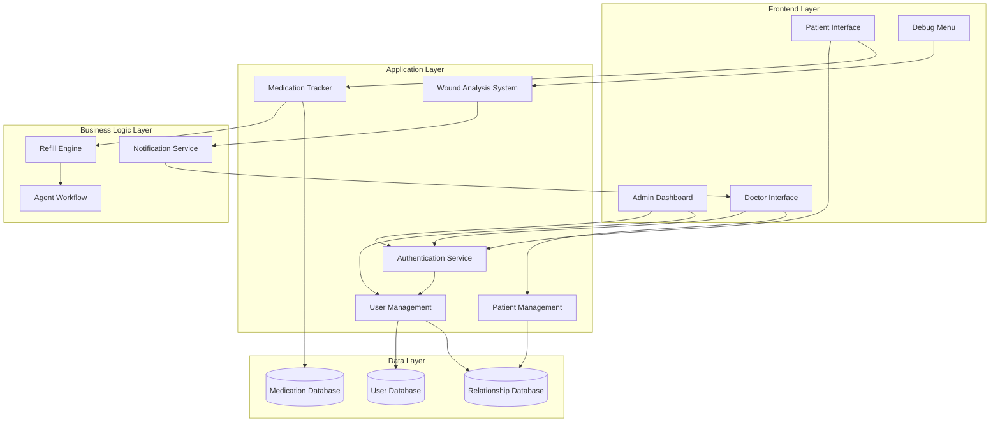

# Design Document: RecoveryPilot Enhancements

## Overview

This design extends the RecoveryPilot application with five major enhancements:

1. **Admin Dashboard**: A new administrative interface for user management and patient-doctor assignments
2. **Doctor Patient Management**: Enhanced doctor interface for managing patient care lists
3. **Testing Scenarios**: Debug menu controls for simulating different wound analysis outcomes
4. **Medication Tracking**: Real-time inventory tracking of patient medication supplies
5. **Auto-Refill Ordering**: Automated medication refill requests triggered by low inventory

The design maintains separation between roles (Admin, Doctor, Patient) and ensures data privacy through role-based access control. The medication tracking system integrates with the existing agent workflow for seamless refill processing.

## Architecture

### System Components



### Architectural Principles

1. **Role-Based Access Control (RBAC)**: All features are gated by user role authentication
2. **Separation of Concerns**: UI, business logic, and data layers are clearly separated
3. **Event-Driven Refills**: Medication tracking triggers refill events automatically
4. **Existing Integration**: New features integrate with existing agent workflow and notification systems
5. **Testability**: Debug menu provides controlled testing scenarios without affecting production data

## Components and Interfaces

### 1. Authentication Service

**Responsibility**: Verify user identity and role, enforce access control

**Interface**:
```typescript
interface AuthService {
  // Authenticate user credentials
  authenticate(username: string, password: string): Promise<AuthToken>
  
  // Verify token and return user role
  verifyToken(token: AuthToken): Promise<UserRole>
  
  // Check if user has permission for action
  hasPermission(token: AuthToken, action: string): Promise<boolean>
}

enum UserRole {
  ADMIN = "admin",
  DOCTOR = "doctor",
  PATIENT = "patient"
}

interface AuthToken {
  userId: string
  role: UserRole
  expiresAt: Date
}
```

### 2. User Management Service

**Responsibility**: Create and manage user accounts, handle user-doctor relationships

**Interface**:
```typescript
interface UserManagementService {
  // Create new user account
  createUser(userData: UserCreationData): Promise<User>
  
  // Get all users (admin only)
  getAllUsers(): Promise<User[]>
  
  // Assign patient to doctor
  assignPatientToDoctor(patientId: string, doctorId: string): Promise<void>
  
  // Get patients assigned to doctor
  getPatientsForDoctor(doctorId: string): Promise<Patient[]>
  
  // Remove patient from doctor's care list
  removePatientFromDoctor(patientId: string, doctorId: string): Promise<void>
}

interface UserCreationData {
  username: string
  password: string
  role: UserRole
  email: string
  fullName: string
  // Role-specific fields
  specialization?: string  // For doctors
  dateOfBirth?: Date       // For patients
}

interface User {
  id: string
  username: string
  role: UserRole
  email: string
  fullName: string
  createdAt: Date
}
```

### 3. Medication Tracker

**Responsibility**: Track medication inventory, trigger refill requests

**Interface**:
```typescript
interface MedicationTracker {
  // Record medication taken
  recordMedicationTaken(patientId: string, medicationId: string): Promise<void>
  
  // Get current tablet count
  getTabletCount(patientId: string, medicationId: string): Promise<number>
  
  // Check if refill needed
  checkRefillNeeded(patientId: string, medicationId: string): Promise<boolean>
  
  // Get medication details for display
  getMedicationDetails(patientId: string, medicationId: string): Promise<MedicationDetails>
}

interface MedicationDetails {
  medicationId: string
  name: string
  dosage: string
  tabletsRemaining: number
  refillThreshold: number
  lastTaken?: Date
  refillInProgress: boolean
}
```

### 4. Refill Engine

**Responsibility**: Manage automatic refill requests, prevent duplicates, invoke agent workflow

**Interface**:
```typescript
interface RefillEngine {
  // Trigger refill request
  requestRefill(patientId: string, medicationId: string): Promise<RefillRequest>
  
  // Check if refill already in progress
  hasActiveRefill(patientId: string, medicationId: string): Promise<boolean>
  
  // Complete refill request
  completeRefill(requestId: string, outcome: RefillOutcome): Promise<void>
}

interface RefillRequest {
  requestId: string
  patientId: string
  medicationId: string
  requestedAt: Date
  status: RefillStatus
}

enum RefillStatus {
  PENDING = "pending",
  INSURANCE_CHECK = "insurance_check",
  PHARMACY_CHECK = "pharmacy_check",
  APPROVED = "approved",
  REJECTED = "rejected"
}

interface RefillOutcome {
  success: boolean
  message: string
  estimatedDelivery?: Date
}
```

### 5. Wound Analysis System (Enhanced)

**Responsibility**: Analyze wound photos, support test scenarios, create doctor notifications

**Interface**:
```typescript
interface WoundAnalysisSystem {
  // Analyze wound photo
  analyzeWound(photoData: Blob, patientId: string): Promise<AnalysisResult>
  
  // Set test scenario (debug only)
  setTestScenario(scenario: TestScenario): void
  
  // Get current scenario
  getCurrentScenario(): TestScenario
}

enum TestScenario {
  SCENARIO_HAPPY_PATH = "happy_path",
  SCENARIO_RISK_DETECTED = "risk_detected",
  PRODUCTION = "production"
}

interface AnalysisResult {
  confidence: number  // 0-100
  riskStatus: RiskStatus
  analysis: string
  timestamp: Date
}

enum RiskStatus {
  GREEN = "green",  // Healing well
  RED = "red"       // Risk detected
}
```

### 6. Debug Menu Controller

**Responsibility**: Provide testing controls for developers

**Interface**:
```typescript
interface DebugMenuController {
  // Toggle debug menu visibility (Ctrl+Shift+D)
  toggleMenu(): void
  
  // Set wound analysis scenario
  setWoundScenario(scenario: TestScenario): void
  
  // Reset mission for re-testing
  resetMission(patientId: string, missionId: string): Promise<void>
  
  // Get available scenarios
  getAvailableScenarios(): TestScenario[]
}
```

## Data Models

### User Model

```typescript
interface User {
  id: string
  username: string
  passwordHash: string
  role: UserRole
  email: string
  fullName: string
  createdAt: Date
  updatedAt: Date
}
```

### Patient-Doctor Relationship Model

```typescript
interface PatientDoctorRelationship {
  id: string
  patientId: string
  doctorId: string
  assignedAt: Date
  assignedBy: string  // Admin user ID
  active: boolean
}
```

### Medication Inventory Model

```typescript
interface MedicationInventory {
  id: string
  patientId: string
  medicationId: string
  medicationName: string
  dosage: string
  tabletsRemaining: number
  refillThreshold: number
  lastUpdated: Date
}
```

### Refill Request Model

```typescript
interface RefillRequestRecord {
  id: string
  patientId: string
  medicationId: string
  requestedAt: Date
  completedAt?: Date
  status: RefillStatus
  outcome?: RefillOutcome
  agentWorkflowId?: string
}
```

### Action Item Model (Enhanced)

```typescript
interface ActionItem {
  id: string
  doctorId: string
  patientId: string
  type: ActionItemType
  priority: Priority
  createdAt: Date
  resolvedAt?: Date
  data: any  // Type-specific data
}

enum ActionItemType {
  WOUND_RISK = "wound_risk",
  MEDICATION_ISSUE = "medication_issue",
  GENERAL = "general"
}

enum Priority {
  HIGH = "high",
  MEDIUM = "medium",
  LOW = "low"
}
```

### Mission Model (Enhanced)

```typescript
interface Mission {
  id: string
  patientId: string
  type: MissionType
  status: MissionStatus
  data: any  // Type-specific data
  createdAt: Date
  completedAt?: Date
  resetCount: number  // For testing
}

enum MissionType {
  MEDICATION = "medication",
  PHOTO_UPLOAD = "photo_upload",
  SURVEY = "survey"
}

enum MissionStatus {
  PENDING = "pending",
  IN_PROGRESS = "in_progress",
  COMPLETED = "completed",
  RESET = "reset"
}
```

