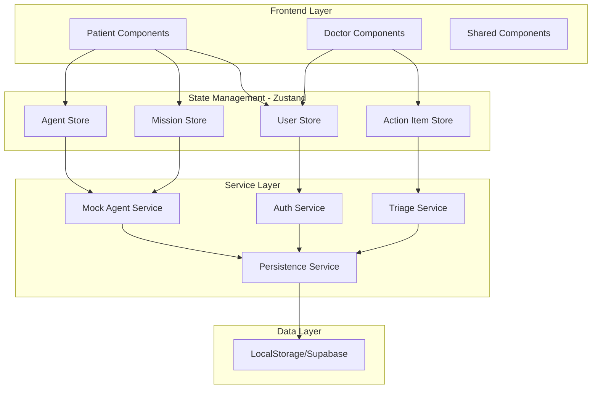

# Design Document: RecoveryPilot

## Overview

RecoveryPilot is a React-based autonomous care orchestrator that gamifies post-operative recovery while automating medical logistics through simulated AI agents. The system features two distinct user experiences: a mobile-first patient dashboard with mission-based engagement and a desktop-optimized doctor dashboard for efficient triage review.

The architecture emphasizes clear separation between UI components, state management (Zustand), and business logic (mock agent services). The MVP uses simulated AI responses with configurable scenarios for reliable demonstration, while maintaining the structure to integrate real AI APIs in production.

## Architecture

### High-Level Architecture



### Routing Structure

```
/
├── /login              → LoginPage (role selection)
├── /patient            → PatientDashboard
│   ├── /missions       → Mission stream (default view)
│   └── /profile        → Patient profile & streak
└── /doctor             → DoctorDashboard
    ├── /triage         → Action item inbox (default view)
    └── /profile        → Doctor profile
```

### Technology Stack

- **Frontend Framework**: React 18+ with Vite
- **Styling**: Tailwind CSS with custom theme configuration
- **State Management**: Zustand (separate stores per domain)
- **Routing**: React Router v6
- **Icons**: Lucide React
- **Animations**: Framer Motion for gamification effects
- **Data Persistence**: LocalStorage (MVP) with Supabase adapter interface
- **Image Handling**: Browser File API with preview support

### Theme & Visual Design Strategy

To balance "Clinical Trust" with "Gamified Engagement", the system will use a split-palette approach:

1.  **The "Medical Core" (Trust):**
    * Backgrounds: `slate-50`
    * Text: `slate-900`
    * Primary: `blue-600` (Pantone 2144 C)
    * Used for: Navigation, Triage forms, Doctor Dashboard.

2.  **The "Gamified Layer" (Engagement):**
    * Accent: `violet-500` (Streak counters)
    * Success: `emerald-400` (Mission Complete)
    * Agent Active: `amber-400` (AI thinking state)
    * Used for: Mission Cards, Agent Overlay, Celebrations.

3.  **Typography:**
    * Headings: `Inter` (Clean, readable)
    * Gamification Numbers: `Space Grotesk` (Monospace-ish, techy feel)

## Components and Interfaces

### Core Component Hierarchy

#### Patient Dashboard Components

```
PatientDashboard
├── Header
│   ├── StreakDisplay
│   └── ProfileButton
├── MissionStream
│   ├── MissionCard (multiple)
│   │   ├── MissionIcon
│   │   ├── MissionDetails
│   │   └── SmartActionButton
│   └── EmptyState
├── PhotoCaptureModal
│   ├── CameraInterface
│   ├── ImagePreview
│   └── SubmitButton
├── AgentStatusToast
│   └── StatusStepList
└── CelebrationOverlay
    └── ConfettiAnimation
```

#### Doctor Dashboard Components

```
DoctorDashboard
├── Header
│   ├── NotificationBadge
│   └── ProfileButton
├── TriageInbox
│   ├── ActionItemCard (multiple)
│   │   ├── PatientInfo
│   │   ├── TriageDetails
│   │   │   ├── WoundImage
│   │   │   └── AIAnalysis
│   │   ├── RefillDetails
│   │   │   ├── InsuranceStatus
│   │   │   └── InventoryStatus
│   │   └── ActionButtons
│   │       ├── ApproveButton
│   │       └── RejectButton
│   └── EmptyState
└── RejectionModal
    ├── ReasonTextarea
    └── SubmitButton
```

### Component Interfaces

#### MissionCard Component

```typescript
interface Mission {
  id: string;
  type: 'photo_upload' | 'medication_check' | 'exercise_log';
  title: string;
  description: string;
  status: 'pending' | 'completed' | 'overdue';
  dueDate: Date;
  actionButtonText: string;
}

interface MissionCardProps {
  mission: Mission;
  onAction: (missionId: string) => void;
}
```

#### ActionItemCard Component

```typescript
interface ActionItem {
  id: string;
  patientId: string;
  patientName: string;
  type: 'triage' | 'refill';
  status: 'pending_agent' | 'pending_doctor' | 'approved' | 'rejected';
  createdAt: Date;
  aiConfidenceScore?: number;
  
  // Triage-specific fields
  triageData?: {
    imageUrl: string;
    analysis: 'green' | 'red';
    analysisText: string;
    confidenceScore: number;
  };
  
  // Refill-specific fields
  refillData?: {
    medicationName: string;
    insuranceStatus: 'approved' | 'pending' | 'denied';
    inventoryStatus: 'in_stock' | 'out_of_stock';
  };
}

interface ActionItemCardProps {
  actionItem: ActionItem;
  onApprove: (itemId: string) => void;
  onReject: (itemId: string, reason: string) => void;
}
```

#### AgentStatusToast Component

```typescript
interface AgentStep {
  id: string;
  label: string;
  status: 'pending' | 'in_progress' | 'completed' | 'failed';
  duration?: number; // milliseconds
}

interface AgentStatusToastProps {
  steps: AgentStep[];
  isVisible: boolean;
  onComplete: () => void;
}
```

### Zustand Store Interfaces

#### User Store

```typescript
interface User {
  id: string;
  name: string;
  role: 'patient' | 'doctor';
  streakCount?: number; // Only for patients
}

interface UserStore {
  currentUser: User | null;
  isAuthenticated: boolean;
  
  // Actions
  login: (credentials: { username: string; password: string }) => Promise<void>;
  logout: () => void;
  updateStreak: (newCount: number) => void;
}
```

#### Mission Store

```typescript
interface MissionStore {
  missions: Mission[];
  isLoading: boolean;
  
  // Actions
  fetchMissions: (userId: string) => Promise<void>;
  completeMission: (missionId: string) => Promise<void>;
  uploadPhoto: (missionId: string, imageFile: File) => Promise<void>;
}
```

#### Agent Store

```typescript
interface AgentStore {
  currentWorkflow: AgentStep[] | null;
  isProcessing: boolean;
  
  // Actions
  startTriageWorkflow: (imageFile: File) => Promise<void>;
  startRefillWorkflow: (medicationName: string) => Promise<void>;
  clearWorkflow: () => void;
}
```

#### Action Item Store

```typescript
interface ActionItemStore {
  actionItems: ActionItem[];
  isLoading: boolean;
  
  // Actions
  fetchActionItems: (doctorId: string) => Promise<void>;
  approveItem: (itemId: string) => Promise<void>;
  rejectItem: (itemId: string, reason: string) => Promise<void>;
}
```

## Data Models

### Database Schema (LocalStorage Structure)

```typescript
// LocalStorage Keys
const STORAGE_KEYS = {
  USERS: 'recovery_pilot_users',
  MISSIONS: 'recovery_pilot_missions',
  ACTION_ITEMS: 'recovery_pilot_action_items',
  CONFIG: 'recovery_pilot_config'
};

// User Model
interface UserModel {
  id: string;
  username: string;
  passwordHash: string; // Simple hash for MVP
  name: string;
  role: 'patient' | 'doctor';
  streakCount: number;
  lastLoginDate: string; // ISO date string
  createdAt: string;
}

// Mission Model
interface MissionModel {
  id: string;
  patientId: string;
  type: 'photo_upload' | 'medication_check' | 'exercise_log';
  title: string;
  description: string;
  status: 'pending' | 'completed' | 'overdue';
  dueDate: string; // ISO date string
  completedAt?: string;
  metadata?: Record<string, any>;
}

// Action Item Model
interface ActionItemModel {
  id: string;
  patientId: string;
  patientName: string;
  type: 'triage' | 'refill';
  status: 'pending_agent' | 'pending_doctor' | 'approved' | 'rejected';
  createdAt: string;
  updatedAt: string;
  
  // Triage fields
  imageUrl?: string;
  triageAnalysis?: 'green' | 'red';
  triageText?: string;
  aiConfidenceScore?: number;
  
  // Refill fields
  medicationName?: string;
  insuranceStatus?: 'approved' | 'pending' | 'denied';
  inventoryStatus?: 'in_stock' | 'out_of_stock';
  
  // Doctor response
  doctorId?: string;
  rejectionReason?: string;
}

// Config Model (for demo scenarios)
interface ConfigModel {
  demoScenario: 'SCENARIO_HAPPY_PATH' | 'SCENARIO_RISK_DETECTED';
  mockDelayMs: number;
}
```

### Seed Data for MVP

```typescript
// Default users for testing
const SEED_USERS: UserModel[] = [
  {
    id: 'patient-1',
    username: 'divya',
    passwordHash: 'simple_hash_divya',
    name: 'Divya Patel',
    role: 'patient',
    streakCount: 3,
    lastLoginDate: new Date().toISOString(),
    createdAt: new Date().toISOString()
  },
  {
    id: 'doctor-1',
    username: 'dr.smith',
    passwordHash: 'simple_hash_smith',
    name: 'Dr. Sarah Smith',
    role: 'doctor',
    streakCount: 0,
    lastLoginDate: new Date().toISOString(),
    createdAt: new Date().toISOString()
  }
];

// Default missions for patient
const SEED_MISSIONS: MissionModel[] = [
  {
    id: 'mission-1',
    patientId: 'patient-1',
    type: 'photo_upload',
    title: 'Mission 1: Scan Incision',
    description: 'Take a photo of your surgical incision for healing assessment',
    status: 'pending',
    dueDate: new Date().toISOString()
  },
  {
    id: 'mission-2',
    patientId: 'patient-1',
    type: 'medication_check',
    title: 'Mission 2: Medication Check',
    description: 'Confirm you took your morning antibiotics',
    status: 'pending',
    dueDate: new Date().toISOString()
  }
];
```

## Service Layer Design

### Mock Agent Service

The Mock Agent Service simulates AI-driven workflows with configurable delays and scenario-based responses.

```typescript
interface AgentService {
  // Triage workflow
  analyzeWoundImage(imageFile: File, scenario: DemoScenario): Promise<TriageResult>;
  
  // Refill workflow
  processRefillRequest(medicationName: string, scenario: DemoScenario): Promise<RefillResult>;
  
  // Workflow step simulation
  simulateWorkflowSteps(steps: AgentStep[]): AsyncGenerator<AgentStep>;
}

interface TriageResult {
  analysis: 'green' | 'red';
  analysisText: string;
  confidenceScore: number;
  actionItemId?: string; // Created if red
}

interface RefillResult {
  insuranceStatus: 'approved' | 'denied';
  inventoryStatus: 'in_stock' | 'out_of_stock';
  actionItemId: string;
}

type DemoScenario = 'SCENARIO_HAPPY_PATH' | 'SCENARIO_RISK_DETECTED';
```

#### Triage Workflow Implementation

```typescript
async function analyzeWoundImage(
  imageFile: File, 
  scenario: DemoScenario
): Promise<TriageResult> {
  const steps: AgentStep[] = [
    { id: '1', label: 'Analyzing Image...', status: 'pending', duration: 1000 },
    { id: '2', label: 'Drafting Clinical Note...', status: 'pending', duration: 1000 },
    { id: '3', label: 'Creating Appointment Slot...', status: 'pending', duration: 1000 }
  ];
  
  // Execute steps with delays
  for await (const step of simulateWorkflowSteps(steps)) {
    // Update agent store with step progress
    agentStore.updateStep(step);
  }
  
  // Return result based on scenario
  if (scenario === 'SCENARIO_RISK_DETECTED') {
    const actionItem = await createActionItem({
      type: 'triage',
      triageAnalysis: 'red',
      triageText: 'Redness detected around incision site. Possible infection.',
      aiConfidenceScore: 0.87
    });
    
    return {
      analysis: 'red',
      analysisText: 'Redness detected. I have auto-drafted a message to Dr. Smith.',
      confidenceScore: 0.87,
      actionItemId: actionItem.id
    };
  }
  
  return {
    analysis: 'green',
    analysisText: 'Healing well. Keep it dry.',
    confidenceScore: 0.92
  };
}
```

#### Refill Workflow Implementation

```typescript
async function processRefillRequest(
  medicationName: string,
  scenario: DemoScenario
): Promise<RefillResult> {
  const steps: AgentStep[] = [
    { id: '1', label: 'Checking Pharmacy Inventory (Mock API)...', status: 'pending', duration: 1000 },
    { id: '2', label: 'Verifying Insurance Coverage...', status: 'pending', duration: 1000 },
    { id: '3', label: 'Order Placed.', status: 'pending', duration: 500 }
  ];
  
  for await (const step of simulateWorkflowSteps(steps)) {
    agentStore.updateStep(step);
  }
  
  const insuranceStatus = scenario === 'SCENARIO_HAPPY_PATH' ? 'approved' : 'approved';
  const inventoryStatus = 'in_stock';
  
  const actionItem = await createActionItem({
    type: 'refill',
    medicationName,
    insuranceStatus,
    inventoryStatus
  });
  
  return {
    insuranceStatus,
    inventoryStatus,
    actionItemId: actionItem.id
  };
}
```

### Persistence Service

```typescript
interface PersistenceService {
  // Generic CRUD operations
  get<T>(key: string): T | null;
  set<T>(key: string, value: T): void;
  update<T>(key: string, updater: (current: T) => T): void;
  delete(key: string): void;
  
  // Specific domain operations
  getUser(userId: string): UserModel | null;
  saveUser(user: UserModel): void;
  getMissions(patientId: string): MissionModel[];
  saveMission(mission: MissionModel): void;
  getActionItems(doctorId?: string): ActionItemModel[];
  saveActionItem(item: ActionItemModel): void;
}
```

### Authentication Service

```typescript
interface AuthService {
  login(username: string, password: string): Promise<User>;
  logout(): void;
  getCurrentUser(): User | null;
  validateCredentials(username: string, password: string): boolean;
}

// Simple implementation for MVP
async function login(username: string, password: string): Promise<User> {
  const users = persistenceService.get<UserModel[]>(STORAGE_KEYS.USERS) || SEED_USERS;
  const user = users.find(u => u.username === username);
  
  if (!user || user.passwordHash !== `simple_hash_${password}`) {
    throw new Error('Invalid credentials');
  }
  
  // Update last login
  user.lastLoginDate = new Date().toISOString();
  persistenceService.saveUser(user);
  
  return {
    id: user.id,
    name: user.name,
    role: user.role,
    streakCount: user.streakCount
  };
}
```


## Correctness Properties

*A property is a characteristic or behavior that should hold true across all valid executions of a system—essentially, a formal statement about what the system should do. Properties serve as the bridge between human-readable specifications and machine-verifiable correctness guarantees.*

### Property 1: Authentication Success and Failure

*For any* user credentials (patient or doctor), when valid credentials are provided, authentication should succeed and display the role-appropriate dashboard; when invalid credentials are provided, authentication should fail with an error message.

**Validates: Requirements 1.1, 1.2, 2.1, 2.2**

### Property 2: Profile Data Persistence Round-Trip

*For any* user profile (patient or doctor) with all required fields (name, user ID, role, streak count for patients), storing the profile then retrieving it should produce an equivalent profile with all fields intact.

**Validates: Requirements 1.3, 2.3, 12.1**

### Property 3: Streak Persistence Round-Trip

*For any* patient with a streak count, logging out then logging back in should retrieve the same streak count.

**Validates: Requirements 1.4, 10.4**

### Property 4: Mission Stream Display Completeness

*For any* patient with active missions, the dashboard should display all missions in prioritized order, with each mission showing title, description, status, and action button.

**Validates: Requirements 3.1, 3.2, 3.3**

### Property 5: Smart Action Button Context Adaptation

*For any* mission type (photo upload, confirmation, external action), the action button text should match the mission type's expected text ("Scan Incision" for photo uploads, "Mark Complete" for confirmations, etc.).

**Validates: Requirements 4.1, 4.2, 4.3**

### Property 6: Action Button Execution

*For any* mission, clicking the action button should execute the corresponding mission-specific action (camera launch for photo missions, status update for confirmation missions, etc.).

**Validates: Requirements 4.4**

### Property 7: Photo Preview Display

*For any* image file selected or captured, the system should display a preview before submission.

**Validates: Requirements 5.2**

### Property 8: Photo Submission Triggers Analysis

*For any* confirmed photo submission, the system should upload the image and initiate AI triage analysis.

**Validates: Requirements 5.3**

### Property 9: Triage Analysis Execution

*For any* uploaded wound photo, the system should process it through AI triage analysis.

**Validates: Requirements 6.1**

### Property 10: Triage Result Categorization

*For any* completed triage analysis, the result must be categorized as either Green (healing well) or Red (risk detected), with no other categories possible.

**Validates: Requirements 6.2**

### Property 11: Green Result Feedback

*For any* triage analysis with Green result, the system should display positive feedback and care instructions.

**Validates: Requirements 6.3**

### Property 12: Red Result Action Item Creation

*For any* triage analysis with Red result, the system should create an action item for doctor review and notify the patient.

**Validates: Requirements 6.4**

### Property 13: Confidence Score Storage

*For any* triage analysis, the system should store an AI confidence score with the result.

**Validates: Requirements 6.5**

### Property 14: Red Triage Workflow Execution

*For any* Red triage result, the agent should execute a multi-step workflow with steps: "Analyzing Image", "Drafting Clinical Note", and "Creating Appointment Slot", each with appropriate delays.

**Validates: Requirements 7.1**

### Property 15: Refill Workflow Execution

*For any* medication refill request, the agent should execute a workflow with steps: "Checking Pharmacy Inventory", "Verifying Insurance Coverage", and "Order Placed".

**Validates: Requirements 7.2**

### Property 16: Agent Workflow Visibility

*For any* agent workflow (triage or refill), the system should display workflow steps visually in a status toast or card.

**Validates: Requirements 7.3**

### Property 17: Doctor Inbox Display

*For any* doctor accessing the dashboard, all pending action items should be displayed in priority order.

**Validates: Requirements 8.1**

### Property 18: Action Item Display Completeness

*For any* action item, the display should include patient name, request type, and type-specific details (insurance/inventory for refills, photo/analysis/confidence for triage).

**Validates: Requirements 8.2, 8.3, 8.4**

### Property 19: Action Item Review Buttons

*For any* action item viewed by a doctor, both Approve and Reject buttons should be displayed.

**Validates: Requirements 9.1**

### Property 20: Approval State Transition

*For any* action item, when a doctor clicks Approve, the status should update to "approved" and a patient notification should be triggered.

**Validates: Requirements 9.2**

### Property 21: Rejection State Transition

*For any* action item, when a doctor clicks Reject, the status should update to "rejected" and a prompt for rejection reason should appear.

**Validates: Requirements 9.3**

### Property 22: Decision Recording

*For any* doctor decision (approve or reject), the system should record the timestamp and reasoning.

**Validates: Requirements 9.4**

### Property 23: Streak Increment on Completion

*For any* patient who completes all daily missions, the streak count should increment by exactly one.

**Validates: Requirements 10.1**

### Property 24: Streak Reset on Miss

*For any* patient who misses a day of missions, the streak count should reset to zero.

**Validates: Requirements 10.2**

### Property 25: Streak Display Visibility

*For any* patient dashboard, the current streak count should be prominently displayed.

**Validates: Requirements 10.3**

### Property 26: Milestone Confetti Trigger

*For any* streak milestone achievement, the system should trigger a full-screen confetti animation.

**Validates: Requirements 11.3**

### Property 27: Data Persistence Round-Trip

*For any* data change (action item creation/update, mission completion), storing the data then retrieving it should produce equivalent data with all fields intact.

**Validates: Requirements 12.2, 12.3**

### Property 28: JSON Serialization Validity

*For any* data stored in LocalStorage, the serialized format should be valid JSON that can be parsed without errors.

**Validates: Requirements 12.4**

### Property 29: Responsive Viewport Rendering

*For any* viewport size from 320px (mobile) to 4K desktop, the appropriate dashboard (patient mobile-first or doctor desktop-optimized) should render without horizontal scrolling.

**Validates: Requirements 13.1, 13.3, 14.1**

### Property 30: Touch Target Minimum Size

*For any* interactive element in the patient dashboard, the tap target should be at least 44px in both dimensions.

**Validates: Requirements 13.2**

### Property 31: Text Readability Size

*For any* body text element, the font size should be at least 16px.

**Validates: Requirements 13.4**

### Property 32: Multi-Column Layout Activation

*For any* doctor dashboard viewport width of 1024px or greater, action items should be displayed in a multi-column layout.

**Validates: Requirements 14.2**

### Property 33: Keyboard Navigation Support

*For any* common action in the doctor dashboard (approve, reject, navigate), a keyboard shortcut should execute that action.

**Validates: Requirements 14.3**

### Property 34: Scenario Determinism

*For any* demo scenario setting (SCENARIO_HAPPY_PATH or SCENARIO_RISK_DETECTED), the mock AI service should return results that match the scenario consistently across multiple invocations with similar inputs.

**Validates: Requirements 15.2**

## Error Handling

### Authentication Errors

- **Invalid Credentials**: Display user-friendly error message "Invalid username or password" without revealing which field is incorrect (security best practice)
- **Network Errors**: For future API integration, display "Unable to connect. Please check your internet connection."
- **Session Expiration**: Redirect to login page with message "Your session has expired. Please log in again."

### Photo Upload Errors

- **Unsupported Format**: Display "Please upload a JPEG, PNG, or HEIC image"
- **File Too Large**: Display "Image must be under 10MB"
- **Camera Access Denied**: Display "Camera access is required. Please enable it in your browser settings."
- **Upload Failure**: Display "Upload failed. Please try again." with retry button

### Agent Workflow Errors

- **Workflow Timeout**: If a workflow step exceeds 5 seconds, display "Processing is taking longer than expected. Please wait..."
- **Workflow Failure**: Display "Something went wrong. Please try again." and log error details for debugging
- **Partial Workflow Completion**: If some steps succeed but others fail, show which steps completed and allow retry of failed steps

### Data Persistence Errors

- **LocalStorage Full**: Display "Storage is full. Please clear some data or contact support."
- **Serialization Error**: Log error and display "Unable to save data. Please try again."
- **Data Corruption**: If stored data cannot be parsed, clear corrupted data and reinitialize with seed data

### Doctor Dashboard Errors

- **Action Item Load Failure**: Display "Unable to load action items. Please refresh the page."
- **Approval/Rejection Failure**: Display "Unable to process your decision. Please try again." and maintain item in pending state
- **Missing Required Fields**: Prevent submission and highlight missing fields (e.g., rejection reason)

### Graceful Degradation

- **No Missions Available**: Display encouraging empty state: "Great job! No missions right now. Check back tomorrow! 🎉"
- **No Action Items**: Display "All caught up! No pending items to review. ✨"
- **Streak Reset**: When streak resets, display supportive message: "Streak reset, but that's okay! Start fresh today. 💪"

## Testing Strategy

### Dual Testing Approach

RecoveryPilot will use both unit testing and property-based testing to ensure comprehensive coverage:

- **Unit Tests**: Verify specific examples, edge cases, and error conditions
- **Property Tests**: Verify universal properties across all inputs using randomized test data

Both approaches are complementary and necessary. Unit tests catch concrete bugs in specific scenarios, while property tests verify general correctness across a wide range of inputs.

### Property-Based Testing Configuration

**Library Selection**: Use `fast-check` for JavaScript/TypeScript property-based testing

**Test Configuration**:
- Minimum 100 iterations per property test (due to randomization)
- Each property test must reference its design document property
- Tag format: `// Feature: recovery-pilot, Property {number}: {property_text}`

**Example Property Test Structure**:

```typescript
import fc from 'fast-check';

// Feature: recovery-pilot, Property 2: Profile Data Persistence Round-Trip
test('profile persistence round-trip preserves all fields', () => {
  fc.assert(
    fc.property(
      fc.record({
        id: fc.uuid(),
        name: fc.string({ minLength: 1 }),
        role: fc.constantFrom('patient', 'doctor'),
        streakCount: fc.nat()
      }),
      (profile) => {
        // Store profile
        persistenceService.saveUser(profile);
        
        // Retrieve profile
        const retrieved = persistenceService.getUser(profile.id);
        
        // Assert equivalence
        expect(retrieved).toEqual(profile);
      }
    ),
    { numRuns: 100 }
  );
});
```

### Unit Testing Focus Areas

Unit tests should focus on:

1. **Specific Examples**: Concrete scenarios like "patient Divya logs in with correct password"
2. **Edge Cases**: Empty mission lists, zero streak counts, missing optional fields
3. **Error Conditions**: Invalid image formats, network failures, storage quota exceeded
4. **Integration Points**: Component interactions, store updates triggering UI changes
5. **Mock Verification**: Ensuring mock services are called with correct parameters

### Property Testing Focus Areas

Property tests should focus on:

1. **Round-Trip Properties**: Serialization/deserialization, persistence/retrieval
2. **Invariants**: Streak count never negative, mission status always valid enum value
3. **State Transitions**: Approval changes status from pending_doctor to approved
4. **Structural Properties**: All missions have required fields, all action items have patient names
5. **Behavioral Properties**: Button text matches mission type, workflow steps execute in order

### Test Organization

```
src/
├── components/
│   ├── MissionCard.tsx
│   ├── MissionCard.test.tsx          # Unit tests
│   └── MissionCard.property.test.tsx # Property tests
├── stores/
│   ├── userStore.ts
│   ├── userStore.test.ts
│   └── userStore.property.test.ts
└── services/
    ├── agentService.ts
    ├── agentService.test.ts
    └── agentService.property.test.ts
```

### Testing Tools and Libraries

- **Test Runner**: Vitest (fast, Vite-native)
- **Property Testing**: fast-check
- **Component Testing**: React Testing Library
- **Mock Data**: faker-js for generating realistic test data
- **Assertions**: Vitest's built-in assertions + custom matchers

### Coverage Goals

- **Line Coverage**: Minimum 80% for all business logic
- **Branch Coverage**: Minimum 75% for conditional logic
- **Property Coverage**: 100% of design properties must have corresponding property tests
- **Critical Paths**: 100% coverage for authentication, data persistence, and agent workflows

